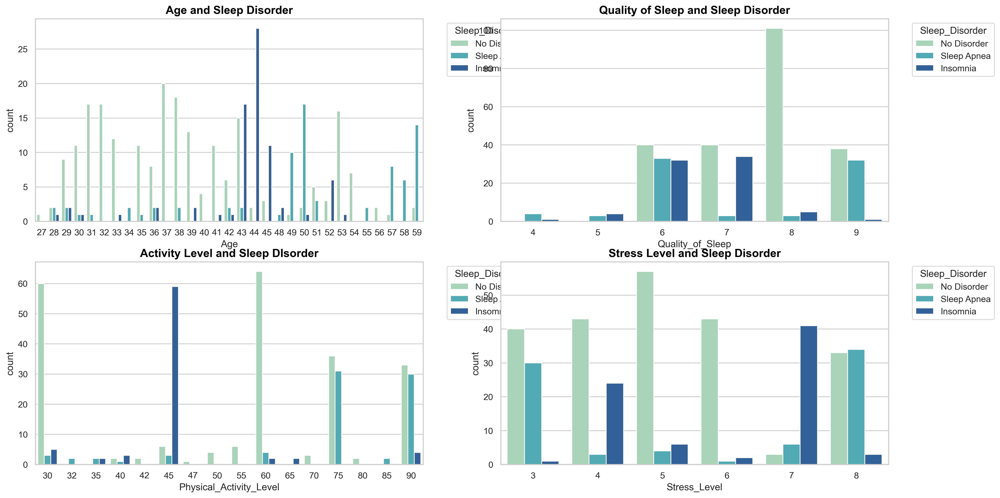
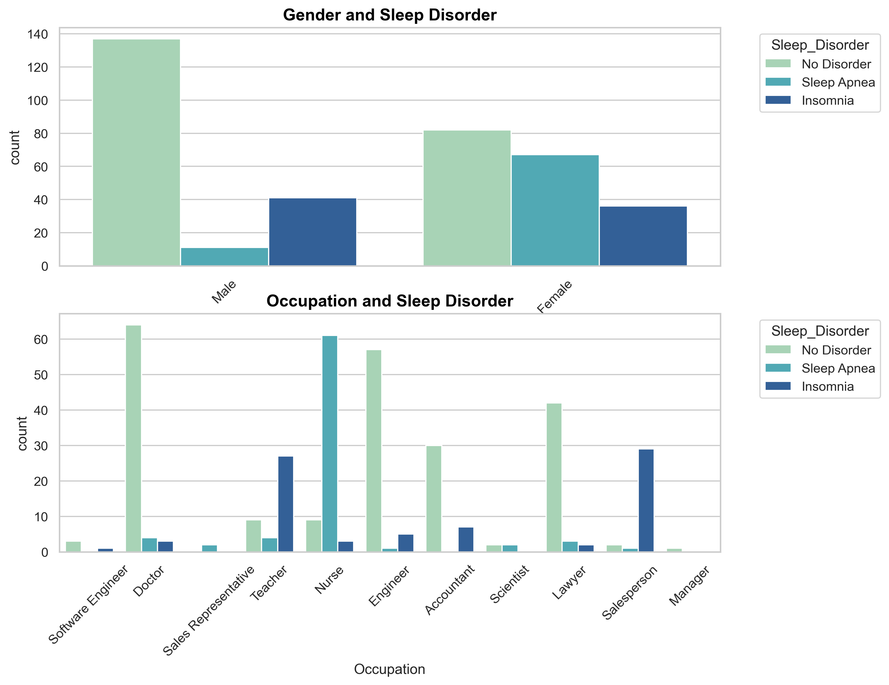

# 💤 Sleep-Disorder-Prediction
A data-driven analysis exploring the relationship between lifestyle and sleep disorder.

## Project Objective:
The focus of this project is to predict sleep disorders from lifestyle factors and cardiovascular functions.
The factors include age, gender, sleep quality, physical activity level, stress level, occupation, heart rate, blood pressure and BMI.
The dataset for this project was obtained from Kaggle, and it contains 374 rows and 13 columns, with 11 independent variables (excluding Person ID) and 1 target variable, 'Sleep Disorder'

## Dataset Description:
The dataset provides a detailed compilation of sleep disorder and lifestyle factors.
The dataset includes the following key features;
Comprehensive Sleep Metrics: This section provides details of sleep duration, sleep quality and the factors influencing sleep patterns.
Lifestyle Factors: This section provides information about age, gender, physical activity levels, stress levels, and BMI categories.
Cardiovascular Health: This section provides information about blood pressure and heart rate measurements.
Sleep Disorder Analysis: This section identifies the occurrence of sleep disorders with the following categories;
- None: Individuals with no sleep disorder
- Insomnia: Individuals that experience difficulty falling asleep or staying asleep, leading to inadequate or poor sleep quality.
- Sleep Apnea: Individuals who suffer from pauses in breathing during sleep, resulting in disrupted sleep patterns and potential health risks.

## Dataset Information:
| Feature                       | Description                                                                |
|-------------------------------|-----------------------------------------------------------------------------|
| Person ID                     | An identifier for each individual.                                          |
| Gender                        | The gender of the person (Male/Female).                                     |
| Age                           | The age of the person in years.                                             |
| Occupation                    | The occupation of the person.                                               |
| Sleep Duration (hours)        | The number of hours the person sleeps per day.                              |
| Quality of Sleep (1-10)       | A subjective rating of sleep quality (scale of 1–10).                       |
| Physical Activity (min/day)   | Minutes of daily physical activity.                                         |
| Stress Level (1-10)           | A subjective rating of stress level (scale of 1–10).                        |
| BMI Category                  | BMI classification (e.g., underweight, normal, overweight).                 |
| Blood Pressure (sys/dia)      | Systolic/Diastolic blood pressure reading.                                  |
| Heart Rate (bpm)              | Resting heart rate in beats per minute.                                     |
| Daily Steps                   | Number of steps taken per day.                                              |
| Sleep Disorder                | Presence of a sleep disorder (None, Insomnia, Sleep Apnea).                 |

## Tools and Libraries used
- Python
- Pandas 
- Numpy
- Matplotlib 
- Seaborn 
- Scikit-learn 
- Jupyter Notebook

## Steps Taken
- Data Importation
- Data Cleaning
- Exploratory Data Analysis
- Data Preprocessing
- Model development
- Model Evaluation
- Model Refinement (Feature Selection)

## Key Visualizations
### 🧠 Lifestyle vs Sleep Disorder

### Gender and Occupation vs Sleep Disorder

*More visuals in the notebook.*

## 📌 Key Insights
- Sleep apnea appeared to be more prevalent in older adults
- Sleep disorders were seen more in individuals who are overweight and obese
- Sleep disorders were seen more in nurses, teachers and salespersons
- Sleep disorders were predominantly high in individuals with high stress level

## Model Building
Classification models were used;
- Random Forest
- Decision Trees
- Extra Trees
- Support Vector Machine

##### Performance Metrics
Random Forest and Support Vector Machine had the best performance

##### Random Forest
+ Accuracy score: 0.867
+ Precision: 0.872
+ Recall: 0.867
+ F1 score: 0.858
+ CV mean: 0.906
+ SV std: 0.039

##### Support Vector Classifier
+ Accuracy score: 0.867
+ Precision: 0.868
+ Recall: 0.867
+ F1 score: 0.867
+ CV mean: 0.893
+ SV std: 0.041

However, while these two models have very similar performance, a major difference between both is that SVC performs significantly better in predicting Class 1 (Sleep Apnea) with a precision and recall score of 0.81. Random Forest on the other hand performas poorly in predicting Class 1 (Sleep Apnea) with a precision and recall scores of 0.90 and 0.56 respectively.
 SVC's cross validation mean is also closer to it's accuracy score than RF's own.
 As a result of all these, Support Vector Classifier is the best model of choice!

## Project Impact
This project will provide insight into the factors influencing sleep disorders, and it will develop a model to predict and identify individuals who are at risk for sleep disorder.
This will improve overall health among all populations
